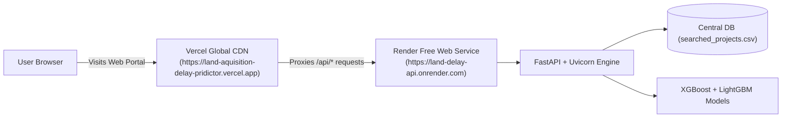

# Production Deployment Plan & Architecture Guide

This document details the production deployment specifications, containerization structure, infrastructure sizing, reverse proxy configurations, and security practices for the **Land Acquisition Intelligence Platform**.

---

## 1. Production Architecture Overview

```mermaid
flowchart TD
    Client["Client Browser (HTTPS / Port 443)"] --> Nginx["Nginx Reverse Proxy & SSL (Certbot)"]

    subgraph Host ["Production Server / Container Host"]
        Nginx -->|/ route (Static Assets)| Frontend["Static Web Server<br/>(Vite React Production Distribution in /dist)"]
        Nginx -->|/api route (Reverse Proxy)| Backend["FastAPI Backend Service (Gunicorn + Uvicorn Workers)<br/>Port 8000"]

        Backend --> ModelRAM["In-Memory Production ML Models<br/>(Loaded from backend/models_saved/*.joblib)"]
        Backend --> StorageVol[("Persistent Volume Mount (/app/data)<br/>• searched_projects.csv (Central Database)<br/>• projects_db/ (Statutory PDF Repository)")]
        Backend --> Tesseract["Tesseract OCR Engine<br/>(tesseract-ocr system package)"]
    end
```

---

## 2. Infrastructure Sizing & System Prerequisites

| Component            | Minimum Specification | Recommended Production | Rationale                                                                       |
| :------------------- | :-------------------- | :--------------------- | :------------------------------------------------------------------------------ |
| **Operating System** | Ubuntu 22.04 LTS      | Ubuntu 24.04 LTS       | Standard, LTS security support                                                  |
| **vCPU**             | 2 vCPUs               | 4 vCPUs                | Concurrency across Gunicorn Uvicorn workers                                     |
| **System RAM**       | 4 GB                  | 8 GB                   | Pre-trained XGBoost, LightGBM & TreeSHAP resident in memory (~1.5 GB footprint) |
| **Storage (SSD)**    | 25 GB                 | 50 GB                  | Docker images, OS packages, statutory PDF archives, and models                  |
| **Network**          | 100 Mbps              | 1 Gbps                 | Fast transmission of GIS GeoJSON layers and PDF documents                       |

---

## 3. Deployment Strategy Options

### Strategy A: Single Cloud VM with Docker Compose (Recommended)

_Ideal for standard government portals, agency pilot deployments, and self-hosted environments._

- **Stack**: Docker, Docker Compose, Nginx, Certbot (Let's Encrypt SSL).
- **Hosting Platforms**: AWS EC2 (`t3.medium` / `t3.large`), GCP Compute Engine (`e2-standard-2`), DigitalOcean Droplet, Azure Virtual Machine.

### Strategy B: Managed Platform-as-a-Service (PaaS)

_Ideal for rapid public demonstrations, staging environments, and zero-infrastructure management._

- **Backend**: Render.com or Railway.app (Docker runtime with persistent volume mount at `/app/data`).
- **Frontend**: Vercel or Netlify (Global CDN serving `frontend/dist`).

### Strategy C: Sovereign Government Cloud / On-Premise

_Ideal for strict statutory compliance and closed government networks._

- **Infrastructure**: National Informatics Centre (NIC MeghRaj Cloud), State Data Centre (SDC), or C-DAC private server.
- **Security**: Private network VPC, air-gapped from public internet, connected to state intranet gateways.

---

## 4. Containerization & Process Architecture

### A. Backend Container (`backend/Dockerfile`)

```dockerfile
FROM python:3.11-slim

# Install system dependencies including Tesseract OCR
RUN apt-get update && apt-get install -y --no-install-recommends \
    tesseract-ocr \
    tesseract-ocr-eng \
    libgl1 \
    poppler-utils \
    curl \
    && rm -rf /var/lib/apt/lists/*

WORKDIR /app

# Copy dependency specifications
COPY requirements.txt .
RUN pip install --no-cache-dir -r requirements.txt gunicorn

# Copy application code, pre-trained models, and document engine
COPY . .

# Expose default internal port
EXPOSE 8000

# Start with Gunicorn managing Uvicorn async workers
CMD ["gunicorn", "-w", "2", "-k", "uvicorn.workers.UvicornWorker", "main:app", "--bind", "0.0.0.0:8000", "--timeout", "120"]
```

### B. Frontend Container (`frontend/Dockerfile`)

```dockerfile
# Stage 1: Build production React assets
FROM node:20-alpine AS builder
WORKDIR /app
COPY package*.json ./
RUN npm ci
COPY . .
RUN npm run build

# Stage 2: Serve static distribution via lightweight Nginx
FROM nginx:alpine
COPY --from=builder /app/dist /usr/share/nginx/html
COPY nginx.conf /etc/nginx/conf.d/default.conf
EXPOSE 80
CMD ["nginx", "-g", "daemon off;"]
```

### C. Docker Compose Orchestration (`docker-compose.yml`)

```yaml
version: "3.8"

services:
  backend:
    build:
      context: ./backend
      dockerfile: Dockerfile
    restart: always
    environment:
      - PORT=8000
      - ENVIRONMENT=production
    volumes:
      # Persistent volume: guarantees Central DB and PDFs survive restarts
      - backend_data:/app/data
    networks:
      - platform_net

  frontend:
    build:
      context: ./frontend
      dockerfile: Dockerfile
    restart: always
    ports:
      - "80:80"
      - "443:443"
    depends_on:
      - backend
    networks:
      - platform_net

volumes:
  backend_data:
    driver: local

networks:
  platform_net:
    driver: bridge
```

---

## 5. Nginx Reverse Proxy & SSL Configuration

Create `nginx.conf` to route traffic securely:

```nginx
server {
    listen 80;
    server_name yourdomain.gov.in www.yourdomain.gov.in;
    return 301 https://$host$request_uri;
}

server {
    listen 443 ssl http2;
    server_name yourdomain.gov.in www.yourdomain.gov.in;

    ssl_certificate /etc/letsencrypt/live/yourdomain.gov.in/fullchain.pem;
    ssl_certificate_key /etc/letsencrypt/live/yourdomain.gov.in/privkey.pem;

    ssl_protocols TLSv1.2 TLSv1.3;
    ssl_ciphers HIGH:!aNULL:!MD5;

    # Gzip Compression
    gzip on;
    gzip_types text/plain text/css application/json application/javascript text/xml application/xml;

    # Frontend Single Page App
    location / {
        root /usr/share/nginx/html;
        index index.html;
        try_files $uri $uri/ /index.html;
    }

    # Backend API Reverse Proxy
    location /api/ {
        proxy_pass http://backend:8000/api/;
        proxy_set_header Host $host;
        proxy_set_header X-Real-IP $remote_addr;
        proxy_set_header X-Forwarded-For $proxy_add_x_forwarded_for;
        proxy_set_header X-Forwarded-Proto $scheme;
        proxy_read_timeout 120s;
    }
}
```

---

## 6. Production Security & Hardening Checklist

1. **CORS Whitelisting**:
   - In `backend/main.py`, replace `allow_origins=["*"]` with explicit domain names:
     ```python
     app.add_middleware(
         CORSMiddleware,
         allow_origins=["https://yourdomain.gov.in"],
         allow_credentials=True,
         allow_methods=["GET", "POST"],
         allow_headers=["*"],
     )
     ```
2. **Firewall (UFW)**:
   - Allow incoming traffic only on ports `22` (SSH), `80` (HTTP), and `443` (HTTPS).
   - Keep internal backend port `8000` inaccessible to the public internet.
3. **Persistent Volume Backup**:
   - Schedule a daily automated backup of `/app/data/searched_projects.csv` and `/app/data/projects_db/` using `rsync` or S3 bucket synchronization.
4. **Active Learning Feedback Protection**:
   - Protect `POST /api/v1/ml/feedback` with API key or JWT authentication before opening to government nodal officers.

---

## 7. Step-by-Step Deployment Commands (Execution Runbook)

On your Ubuntu Linux server:

```bash
# 1. Clone repository
git clone https://github.com/YourOrg/land-acquisition-ai.git /opt/land-ai
cd /opt/land-ai

# 2. Build and launch containers
docker-compose up -d --build

# 3. Verify containers are healthy
docker-compose ps
curl http://localhost/api/v1/health

# 4. Configure Free SSL with Certbot
sudo certbot --nginx -d yourdomain.gov.in

# 5. Review logs
docker-compose logs -f backend
```

---

## 8. Post-Deployment Smoke Tests

- [ ] **Health Endpoint**: `curl https://yourdomain.gov.in/api/v1/health` $\to$ Returns `{"status": "healthy"}`.
- [ ] **Landing Gateway**: Visit `https://yourdomain.gov.in` $\to$ Project Search form displays with autocomplete options.
- [ ] **Inference Test**: Submit _Purvanchal Expressway_ $\to$ Verifies $<20\text{ ms}$ Central Database query and renders all 7 cards.
- [ ] **Navigation Test**: Click "← Back to Search" $\to$ Returns smoothly to the landing portal.
- [ ] **Feedback Test**: Submit a milestone date update $\to$ Verifies record is updated in `searched_projects.csv`.

---

## 9. 100% Free Cloud Deployment Runbook (Render + Vercel)

This runbook documents the exact, step-by-step process for deploying both the backend API and frontend UI on 100% free cloud tiers without requiring credit cards or paid plans.



### Part A: Deploying Backend to Render.com (100% Free)

1. **Create Web Service**:
   - Go to your [Render Dashboard](https://dashboard.render.com).
   - Click **"New +"** (top right) $\rightarrow$ select **"Web Service"**.
2. **Connect Repository**:
   - Click the **"Public Git Repository"** tab.
   - Paste: `https://github.com/AryanSahu321/Land_Aquisition_Delay_pridictor`
   - Click **"Connect"**.
3. **Configure Build & Runtime Settings**:
   - **Name:** `land-delay-api` (or any unique name).
   - **Language:** `Python 3`.
   - **Branch:** `main`.
   - **Region:** `Ohio (US East)` (or nearest region).
   - **Root Directory:** *(Leave blank)*.
   - **Build Command:**
     ```bash
     pip install -r requirements.txt
     ```
   - **Start Command:**
     ```bash
     uvicorn backend.main:app --host 0.0.0.0 --port $PORT
     ```
   - **Instance Type:** Select **Free ($0/month)**.
   - **Environment Variables:** *(None required — the project is self-contained)*.
4. **Deploy**:
   - Click **"Deploy web service"** (at the bottom).
   - Once building finishes (takes ~2 minutes), Render will display your live URL at the top left:
     `https://<your-service-name>.onrender.com`.

---

### Part B: Connecting Vercel Frontend to Render Backend

Once Render provides your backend URL (e.g. `https://land-delay-api.onrender.com`):

1. **Update `frontend/vercel.json`**:
   Replace the destination URL in `frontend/vercel.json`:
   ```json
   {
     "version": 2,
     "rewrites": [
       {
         "source": "/api/:path*",
         "destination": "https://<your-render-service-name>.onrender.com/api/:path*"
       },
       {
         "source": "/(.*)",
         "destination": "/index.html"
       }
     ]
   }
   ```
2. **Commit and Push to GitHub**:
   ```powershell
   git add frontend/vercel.json
   git commit -m "Connect Vercel frontend to Render backend"
   git push origin main
   ```
3. **Automatic Live Update**:
   - Vercel automatically detects the git push and redeploys the frontend within 30 seconds.
   - Open **`https://land-aquisition-delay-pridictor.vercel.app`**:
     - Executing Agency and Ministry dropdowns will be automatically populated from all 50 projects.
     - 1-Click Search and delay risk analysis will execute in real time!
