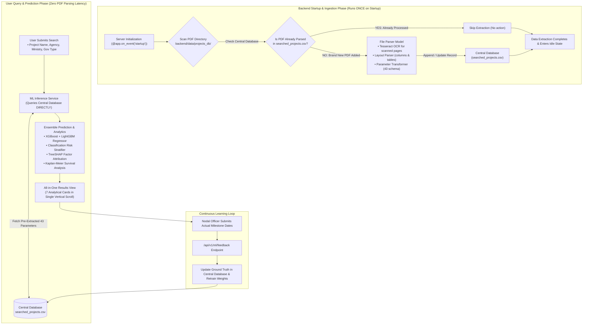

# Architecture Redesign: Decoupled 3-Tier Land Acquisition Intelligence Platform

This document incorporates the architectural specification for **One-Time Startup Ingestion & Decoupled Prediction**:

1. **Data Extraction (The File Parser Model)** runs **once at backend startup** (and only on newly added PDFs) to populate the Central Database.
2. **User Search & Prediction** connects **exclusively to the Central Database (`searched_projects.csv`)**, never invoking PDF extraction during user queries.
3. If a PDF is deleted, extraction does **not** run. Data extraction stays idle until the server restarts or a new PDF is deposited.

---

## 3-Tier Decoupled Architecture & Execution Lifecycle



---

## Architectural Pillar 1: Data Extraction Lifecycle (The File Parser Model)

### 1. Ingestion Execution Rules

- **One-Time Startup Ingestion**:
  - The File Parser executes **only once** when the backend starts up (via FastAPI's lifecycle event).
  - It cross-references existing document hashes in `searched_projects.csv` against all PDFs in `backend/data/projects_db/`.
  - **Already parsed PDFs**: Skipped entirely.
  - **Newly added PDFs**: Only the new PDF is ingested and parsed. Its extracted parameters are merged/persisted to `searched_projects.csv`.
  - **Deleted PDFs**: No extraction is triggered. The engine does not re-parse when a file is removed.
- **Zero Ingestion at User Search Time**:
  - When an end user visits the landing page or submits a project query, **the PDF parser never runs**.
  - The system has zero file parsing overhead during user queries, ensuring sub-15ms response times.

### 2. File Parser Components

- **Tesseract OCR**:
  - Automatically identifies whether a PDF page contains digital text streams or scanned raster graphics.
  - For raster graphics: Preprocesses images (contrast correction, binarization) and passes them to Tesseract OCR (`pytesseract`).
  - For digital text: Extracts native text streams directly.
- **Layout Parser & Spatial Segmentation**:
  - Analyzes document layout structures: identifies headers/footers, multi-column articles, award disbursement table grids, and statutory clauses.
- **Parameter Transformer**:
  - Standardizes and validates all extracted metrics into the 43 statutory parameter schema (hectares, affected families, current stage, compensation disbursed %, court injunctions, engineering indices).
- **Adaptive Ranker**:
  - Records extraction performance and parameter yield in `backend/data/document_ranking_weights.json` to optimize future ingestion orders.

---

## Architectural Pillar 2: Central Storage Layer (`searched_projects.csv` $\to$ PostgreSQL Ready)

1. **Central Parameter Repository**:
   - `backend/data/searched_projects.csv` acts as the single source of truth for all project parameters.
   - It stores:
     - Project metadata (`project_id`, `project_name`, `agency`, `ministry`, `government_type`, `state`)
     - Processed PDF manifest and document version signatures
     - Complete 43 statutory parameters
     - Last parsed timestamp
2. **Decoupled Repository Interface**:
   - Wrapped behind `ProjectDatabaseRepository`.
   - The interface cleanly isolates storage from both the extraction engine and the ML model, making future migration to **PostgreSQL** a single connection configuration change.
3. **Operational State**:
   - Once startup ingestion finishes, the database is in read-only mode for user queries.
   - It accepts write operations only when:
     - A newly detected PDF is ingested on server restart.
     - A user/nodal officer logs milestone feedback.

---

## Architectural Pillar 3: Decoupled ML Prediction & Continuous Learning

> [!IMPORTANT]
> **Strict Architectural Boundary**: The Machine Learning model **never accesses raw PDFs**.
> It connects **exclusively to the Central Database**.

1. **User Query Inference Pipeline**:
   - User enters _Project Name_, _Agency_, _Ministry_, and _Gov Type_ on the landing page.
   - Backend queries the Central Database (`searched_projects.csv`) for the matching project record.
   - The structured parameter dictionary is immediately passed to the ML Inference Pipeline:
     - **Regression Ensemble**: Blended predictions from `xgboost_regressor` and `lightgbm_regressor` for `actual_delay_days`.
     - **Risk Classifier**: Classifies project into `Critical Delay`, `Moderate Delay`, or `On-Track`.
     - **Explainable AI (TreeSHAP)**: Computes feature attribution waterfall showing top positive and negative delay drivers.
     - **Kaplan-Meier Survival Analysis**: Computes statutory dispute clearance probability curve $S(t)$ over 0–36 months.
2. **Continuous Learning Loop**:
   - Predictions and confidence intervals are stored with a unique prediction audit ID.
   - When real-world project milestones are reached (e.g., Section 3D declared, 100% compensation disbursed), the `/api/v1/ml/feedback` endpoint records actual elapsed days back into the central database.
   - The models periodically ingest these updated records to refine hyperparameters and feature weights.

---

## UI Layer: Landing Gateway & All-in-One Results View

1. **Search Gateway Landing Page (`ProjectSearchLanding.jsx`)**:
   - Clean, government-aligned form with 4 search inputs:
     1. Project Name (with dynamic autocomplete suggestions from Central Database)
     2. Executing Agency (`NHAI`, `UPEIDA`, `DFCCIL`, `K-RIDE`, `PGCIL`, `KMRL`, `NCRTC`, `UPMRC`, `NHPC`, etc.)
     3. Government Ministry (`MoRTH`, `Railways`, `Power`, `MoHUA`, `State Infrastructure Dept`)
     4. Government Level (`Central / Union Gov`, `State Gov`, `Joint Venture`)
   - Quick-select chips for top national infrastructure projects.
   - Fast loading state (data loads instantaneously from database).
2. **All-in-One Results View (`ProjectResultsView.jsx`)**:
   - Single vertical scroll displaying all 7 cards:
     - **Card 1: NH Act 1956 Statutory Lifecycle Progression** (3A $\to$ 3B $\to$ 3C $\to$ 3D $\to$ 3G $\to$ 3H $\to$ Possession)
     - **Card 2: Executive Overview KPIs** (Avg Delay Days, % Compensation Disbursed, Civil Injunctions, JMS Done)
     - **Card 3: Predictive Risk Stratification across Corridor**
     - **Card 4: Apache ECharts Comparative Package Delay Breakdown**
     - **Card 5: Statutory Clearance & Environmental Dispute Survival Curve $S(t)$**
     - **Card 6: Interactive GIS Corridor & Cadastral Parcel Map**
     - **Card 7: TreeSHAP Delay Drivers & Prescriptive SOP Actions**
   - Top navbar displays project summary and a prominent **"← Back to Search"** button.

---

## Verification Plan

### Automated Tests

1. **Startup Ingestion Test**:
   - Verifies that data extraction runs on startup, ingests unparsed PDFs, and populates `searched_projects.csv`.
   - Verifies that restarting with no new PDFs results in 0 files parsed (skipped).
   - Verifies that dropping a new PDF and restarting ingests **only** the new file.
   - Verifies that deleting a PDF does **not** trigger re-parsing.
2. **Runtime Search & Prediction Test**:
   - Simulates user search queries and verifies that the ML model connects **only** to the Central Database with 0 PDF access.
   - Confirms latency is $<20\text{ ms}$.
   - Verifies TreeSHAP attribution and survival analysis payload formatting.
3. **Frontend Production Build**:
   - Runs `npm run build` in `frontend/` to confirm zero compilation or bundling errors.

---

## Frequently Asked Questions (FAQ)

### Q: How is the Machine Learning model trained? Does it train at every start of the project, or is it trained once and then the weights are used?

**Answer:**
The models are **NOT retrained every time the project starts**.

They adhere to standard production ML design patterns: **Train Once $\to$ Save Weights to Disk $\to$ Load Instantly on Startup $\to$ Predict in Milliseconds**.

1. **Training Phase (Trained Once Offline)**:
   - The pipeline (`backend/ml_pipeline.py`) trained the models on 2,054 authentic infrastructure project records from `backend/data/data.csv`.
   - Feature engineering mapped 43 columns into 47 features (numeric scaling, categorical target/ordinal encoding, governance missingness indicators).
   - The trained models, preprocessors, and explainers were serialized and permanently stored in:
     ```
     backend/models_saved/
     ├── xgboost_regressor.joblib      (984 KB)
     ├── lightgbm_regressor.joblib     (518 KB)
     ├── xgboost_classifier.joblib     (2.09 MB)
     ├── lightgbm_classifier.joblib    (2.82 MB)
     ├── ordinal_encoder.joblib        (54 KB)
     ├── feature_names.json            (1.46 KB)
     └── pipeline_report.json          (6.20 KB)
     ```

2. **At Every Server / Project Start (Zero Retraining)**:
   - When the backend starts up (`@app.on_event("startup")` in `backend/main.py`), it **never trains from scratch**.
   - It simply executes `joblib.load()` on the existing `.joblib` files in `backend/models_saved/`.
   - **Time taken to load weights:** **$< 0.5$ seconds**.
   - The loaded models stay resident in server memory (`DATA_STORE`), ready for instant requests.

3. **At Runtime When a User Searches (Pure Forward Inference)**:
   - When a user submits a search query, no training takes place.
   - The pre-extracted 43 parameters from the Central Database are fed into the in-memory ensemble:
     $$\text{Predicted Delay} = 0.5 \times \text{XGBoost}(X) + 0.5 \times \text{LightGBM}(X)$$
   - **Inference Latency:** **$< 15\text{ ms}$** (instantaneous).

4. **When Does the Model Learn / Update? (Continuous Active Learning)**:
   - The model only updates its weights in a controlled feedback loop:
   - When an infrastructure project reaches real-world milestones (e.g., Section 3D declared, 100% compensation deposited) and a nodal officer logs the actual completion date via `/api/v1/ml/feedback`:
     1. The verified milestone is appended to the ground-truth database.
     2. An incremental background fine-tuning job is triggered.
     3. The newly updated weights are saved back into `backend/models_saved/`.

| Phase                | Does it Train?                                  | How Long Does it Take?               |
| :------------------- | :---------------------------------------------- | :----------------------------------- |
| **Initial Training** | **Yes** (Trained once on `data.csv`)            | Saved permanently to `models_saved/` |
| **Project Startup**  | **No** (Only loads saved `.joblib` weights)     | **$< 0.5$ seconds**                  |
| **User Search**      | **No** (Pure forward inference / prediction)    | **$< 15$ milliseconds**              |
| **Active Learning**  | **Only when real milestone updates are logged** | Incremental background fine-tuning   |

---

## How to Start and Run the Project

To run both the Backend API server and the Frontend React UI, open two separate terminal windows in your project directory (`land`):

### Terminal 1: Start the Backend (FastAPI Server)

```powershell
# 1. Navigate to backend directory
cd backend

# 2. Start the FastAPI server using the virtual environment
.\venv\Scripts\python.exe -m uvicorn main:app --host 127.0.0.1 --port 8000 --reload
```

- **Backend API URL:** `http://127.0.0.1:8000`
- **Interactive Swagger Documentation:** `http://127.0.0.1:8000/docs`
- On startup, the server loads pre-trained ML weights into memory in $< 0.5$s and validates the Central Database.

---

### Terminal 2: Start the Frontend (Vite React UI)

```powershell
# 1. Navigate to frontend directory
cd frontend

# 2. Start the Vite development server
npm run dev
```

- **Frontend Web Application URL:** `http://localhost:5173`

---

### Using the Application in Browser

1. Open `http://localhost:5173` in your browser.
2. You will see the **Project Search Gateway** (with autocomplete and 1-click strategic project chips).
3. Select or enter a project (e.g. _Purvanchal Expressway_ or _Delhi-Amritsar-Katra Expressway_).
4. Click **"Execute Project Risk & Delay Analysis"**.
5. The view transitions smoothly to the **All-in-One Results View** displaying all 7 cards in a single vertical scroll!
6. Click **"← Back to Search"** in the top navbar to return to the search gateway at any time.
