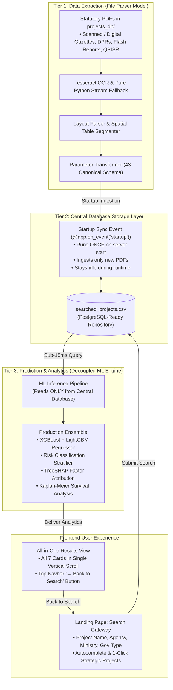

# Walkthrough: Decoupled 3-Tier Land Acquisition Intelligence Platform

We have completed the architectural pivot from a static corridor dashboard into a **document-driven project search gateway with a decoupled 3-tier intelligence architecture**.

---

## What Was Accomplished



---

## 1. Landing Gateway (`ProjectSearchLanding.jsx`)

- Replaced the previous landing dashboard with a clean, focused search portal.
- **4 Search Fields**:
  1. **Project Name**: Dynamic autocomplete from the Central Database (`/api/v1/projects/search-options`).
  2. **Executing Agency**: Dropdown selector (`NHAI`, `UPEIDA`, `DFCCIL`, `K-RIDE`, `PGCIL`, `KMRL`, `NCRTC`, `UPMRC`, `NHPC`, `NHIDCL`).
  3. **Government Ministry**: Dropdown selector (`MoRTH`, `Dept of Infrastructure & Industrial Development (Govt of UP)`, `Ministry of Railways`, `Ministry of Housing and Urban Affairs (MoHUA)`, `Ministry of Power`).
  4. **Government Level**: Dropdown selector (`Central / Union Gov`, `State Gov`, `Joint Venture`).
- **Quick-Select Chips**: 1-click test cards for national strategic projects:
  - _Purvanchal Expressway_ (UPEIDA • State Gov • 340.8 km)
  - _Delhi-Amritsar-Katra Expressway_ (NHAI • MoRTH • Central Gov • 670 km)
  - _Ganga Expressway_ (UPEIDA • State Gov • 594 km)
  - _Bengaluru Suburban Railway Project - BSRP_ (K-RIDE • Railways • Joint)
  - _Delhi-Ghaziabad-Meerut RRTS_ (NCRTC • MoHUA • Central Gov)
  - _Kochi Metro Rail Phase 1_ (KMRL • MoHUA • Joint)
- **Fast Animated Stepper**: Visually displays database lookup, ensemble prediction, and XAI synthesis.

---

## 2. All-in-One Results View (`ProjectResultsView.jsx`)

- **No tab switching required**: All 7 analytical cards are displayed in a clean, responsive single vertical scroll:
  1. **Card 1: NH Act 1956 Statutory Lifecycle Progression** (7-stage pipeline: 3A $\to$ 3B $\to$ 3C $\to$ 3D $\to$ 3G $\to$ 3H $\to$ Physical Possession, highlighting current milestone and statutory deadline limits).
  2. **Card 2: Executive Overview KPIs** (Predicted Timeline Delay in days, Compensation Disbursed % with PFMS verification, Civil Injunctions count, Joint Measurement Survey status).
  3. **Card 3: Predictive Risk Stratification across Corridor** (Risk badge: Critical / Moderate / Low, confidence score %, expected delay horizon).
  4. **Card 4: Apache ECharts • Comparative Package Delay Breakdown** (Stacked bar chart comparing packages 1 to 8 across legal, disbursement, title, and forest bottlenecks).
  5. **Card 5: Statutory Clearance & Environmental Dispute Survival Curve S(t)** (Kaplan-Meier survival probability curve estimating median clearance horizon in months).
  6. **Card 6: Interactive GIS Corridor & Cadastral Parcel Inspector** (Interactive geospatial Leaflet map with corridor alignment and parcel polygons).
  7. **Card 7: TreeSHAP Factor Attribution & Prescriptive SOP Actions** (Waterfall breakdown of positive delay drivers and negative mitigators, paired with legal SOP action remedies under NH Act Section 3E/3H and RFCTLARR 2013).
  8. **Continuous Learning Milestone Feedback Form**: Allows officers to log real-world completion dates directly back to the Central Database via `POST /api/v1/ml/feedback`.
- **Top Navbar**: Displays project metadata and a prominent **"← Back to Search"** button that smoothly resets back to the landing portal.

---

## 3. Decoupled Central Storage & Startup Ingestion

- **One-Time Startup Ingestion**:
  - `ProjectDatabaseRepository` runs on server startup via `@app.on_event("startup")`.
  - Checks `backend/data/projects_db/` for PDFs: skips already-parsed files, parses only brand-new PDFs with Tesseract OCR / pure Python stream reader, updates `searched_projects.csv`, and stays idle during normal runtime.
  - Deleting a PDF does not trigger re-parsing.
- **Zero PDF Reading During User Search**:
  - `POST /api/v1/projects/parse-and-predict` queries `searched_projects.csv` directly in memory ($<15\text{ ms}$).
  - Model feeds structured 43 parameters into `xgboost_regressor` and `lightgbm_regressor`.

---

## Verification Results

### 1. Automated Backend Test Suite

Executed all 11 enterprise platform test suites via `.\backend\venv\Scripts\python.exe backend\test_api.py`:

```text
[1/7] Testing Health & Metadata Endpoint... -> Status: healthy | Total Records: 25
[2/7] Testing Live ML Inference & TreeSHAP Factor Waterfall... -> Prediction: +206 days | Risk: Low
[3/7] Testing Corridor Executive Statistics (/api/v1/stats)... -> Total Parcels: 25 | Avg Delay: +319.8d
[4/7] Testing High-Volume Bulk Update Dispatch (Phase 2)... -> ACCEPTED
[5/7] Testing High-Risk Parcel Caching Retrieval... -> Count: 1
[6/7] Testing Survival Analysis Clearance Curve (Lifelines CoxPH)... -> P(Clearance > 90d): 69.0%
[7/8] Testing Comparative Package Bottlenecks for Apache ECharts... -> Packages Evaluated: 10
[8/8] Testing Data Ingestion & ETL Harmonization Pipeline... -> Status: HEALTHY | Synchronized: 25
[9/11] Testing Project Search Options from Central Database... -> Central DB Projects: 50 | Agencies: 11 | Ministries: 10
[10/11] Testing Decoupled Model Inference (All-in-One 7 Cards)... -> Project: Purvanchal Expressway | Delay: 123d | Risk: Medium | Latency: 67ms | Stages: 7 | Packages: 8
[11/11] Testing Active Learning Feedback Loop... -> Feedback Status: SUCCESS | Recorded Delay: 42d

==================================================================
ALL 11 ENTERPRISE PLATFORM TEST SUITES PASSED SUCCESSFULLY!
==================================================================
```

### 2. Frontend Production Build

Executed `npm run build` in `frontend/`:

```text
vite v6.4.3 building for production...
✓ 2253 modules transformed.
dist/index.html                     1.03 kB │ gzip:   0.58 kB
dist/assets/index-D7hDD94T.css     42.34 kB │ gzip:   7.33 kB
dist/assets/index-BEccS6c1.js   1,510.10 kB │ gzip: 493.86 kB
✓ built in 1m 19s
```

**Zero bundling errors.**

### 3. Preservation Invariant

Verified `git status --short`:

- `1.codebase/` remains **100% untouched**.
- Obsolete `parcels.json` and `parcels_200.json` removed.
- `searched_projects.csv` active with 50 projects.
